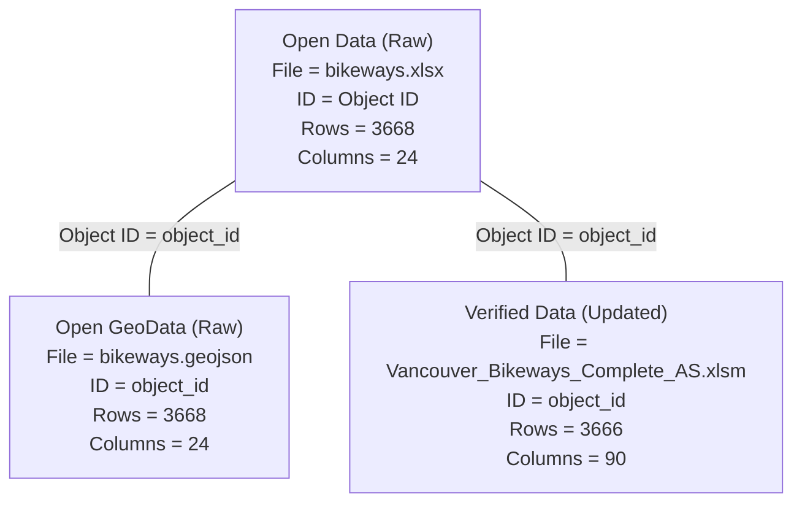

# Vancouver Raw Data

## Open Data

Bikeways Excel (`bikeways.xlsx`) and GeoJSON (`bikeways.geojson`) data downloaded from City of Vancouver Open Data Portal: https://opendata.vancouver.ca/explore/dataset/bikeways

* [bikeways.xlsx](bikeways.xlsx): original bikeways data from city of Vancouver covering 3667 bikeways
* [bikeways.geojson](bikeways.geojson): geospatial format of the bikeways.xlsx data

## Verified Data

Verified bikeways Excel (`Vancouver_Bikeways_Complete_AS.xlsm`) data prepared by Konrad Samsel <konrad.samsel@mail.utoronto.ca>, updated by Adrian, and shared by Brice Batomen Kuimi <brice.kuimi@utoronto.ca>:

* [Vancouver_Bikeways_Complete_AS.xlsm](Vancouver_Bikeways_Complete_AS.xlsm): Updated verified bikeways at Konrad/updated/Vancouver_Bikeways_Complete_AS.xlsm

## Data Relationships

## Contact

* Richard Wen <rrwen.dev@gmail.com>