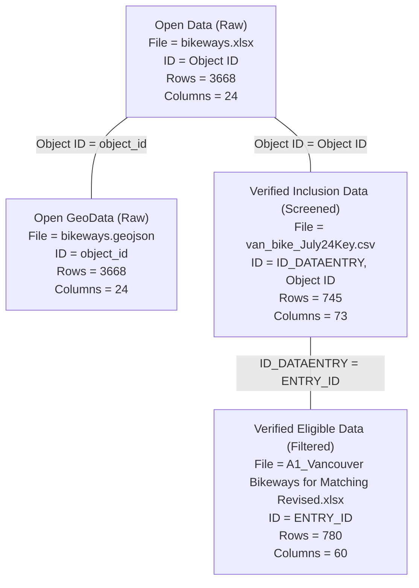

# Vancouver Raw Data

## Open Data

Bikeways Excel (`bikeways.xlsx`) and GeoJSON (`bikeways.geojson`) data downloaded from City of Vancouver Open Data Portal: https://opendata.vancouver.ca/explore/dataset/bikeways

* [bikeways.xlsx](bikeways.xlsx): original bikeways data from city of Vancouver covering 3667 bikeways
* [bikeways.geojson](bikeways.geojson): geospatial format of the bikeways.xlsx data

## Verified Data

Verified bikeways Excel (`A1_Vancouver Bikeways for Matching Revised.xlsx`) and CSV (`van_bike_July24Key.csv`) data prepared by Konrad Samsel <konrad.samsel@mail.utoronto.ca> using document `Vancouver Bikeway Data Management Protocols.docx` shared by Brice Batomen <brice.kuimi@utoronto.ca>, where original paths are shown below:

* [A1_Vancouver Bikeways for Matching Revised.xlsx](A1_Vancouver%20Bikeways%20for%20Matching%20Revised.xlsx): Revised verified bikeways data entry file of 780 eligible road segments using Google StreetView and satellite imagery (after filtering, see [Data Eligibility and Inclusion Section](#data-eligibility-and-inclusion)) at Konrad/1_Vancouver Data/1_Bikeways/3_Vancouver Bikeway Data Analysis/A1_Vancouver Bikeways for Matching Revised.xlsx
* [van_bike_July24Key.csv](van_bike_July24Key.csv): Final verified bikeways data of 745 road segments (after screening, see [Data Eligibility and Inclusion Section](#data-eligibility-and-inclusion)) at Konrad/1_Vancouver Data/1_Bikeways/3_Vancouver Bikeway Data Analysis/van_bike_July24Key.csv

## Documents

The following documents in the `docs` folder are available:

* [Vancouver Bikeway Data Management Protocols.docx](docs/Vancouver%20Bikeway%20Data%20Management%20Protocols.docx): Document for data entry procedures of verified bikeways data at Konrad/1_Vancouver Data/1_Bikeways/2_Vancouver Bikeways Data Entry/Vancouver Bikeway Data Management Protocols.docx

## Data Relationships

## Data Eligibility and Inclusion

## Contact

* Richard Wen <rrwen.dev@gmail.com>